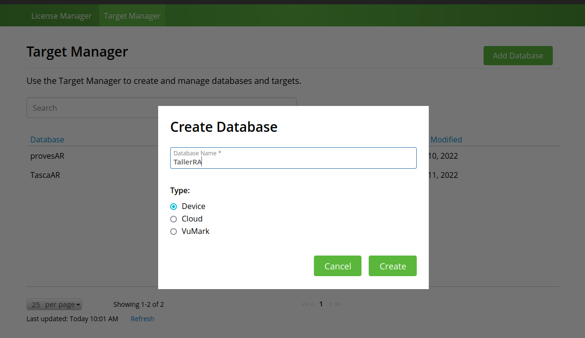
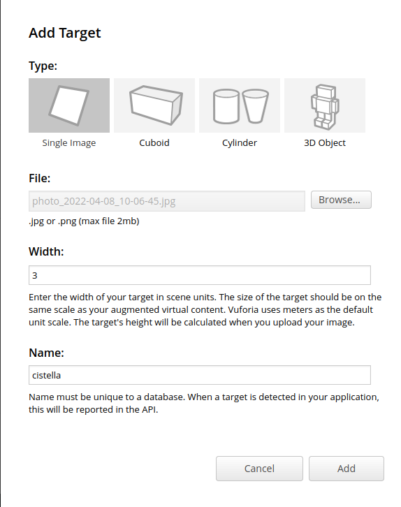
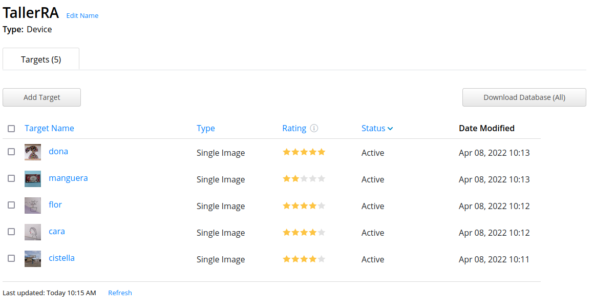
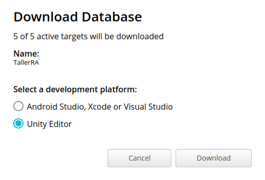
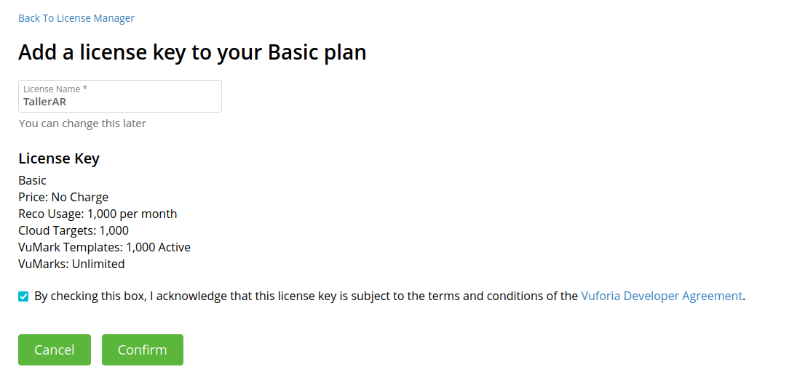

# Treballant amb Vuforia

Una vegada registratas i logats al portal de Vuforia, veiem que tenim principalment dues opcions principals:

* License Manager, per gestionar les llicències de les nostres aplicacions, i
* Target Manager, per crear *databases* i *targets*

## Creació de la Database

El primer que farem és crear una nova base de dades amb targetes, de qualsevol fotografía que tinguem, i que presenten un bon contrast. Per a això:

1. Fem clic en Add Database, i creem una base de dades de tipus Device que anomenarem TallerRA.

    

2. Una vegada creada la base de dades, anem a afegir-li *targets*. Per a això, fem clic a la base de dades, i al botó *Add Target*. Seleccionarem un target de tipus Single Image.

    

    Selecconarem la imatge del nostre ordinador i la pujarem. Caldrà indicar-li la mida aproximada, i si volem un altre nom.

    Realitzarem el mateix procediment per a diverses imatges.

3.  Una vegada pujades, veurem que tenen un Rating. Açò indica la qualitat de la imatge per a que el plugin de Vuforia puga reconéixer-la. A partir de 3 estreles sería acceptable, tot i que de vegades, amb menys estreles també funciona correctament.

    

4. Una vegada tenim la nostra base de dades, podem descarregar-la amb el botó *Download Database (All)* o seleciconant les imatges que volem. **Es important que seleccionem descarregar la base de dades per a la plataforma Unity (Unity Editor)**.

    

    Açò ens descarregarà un fitxer anomenat *TallerRA.unitypackage*, que podrem importar posteriorment amb Unity.

## Obtenció de la llicència

Tot i que disposem d'una llicència gratuita, aquesta és necessària per poder treballar amb el plugin de Vuforia amb Unity. Així que anem a crear una nova llicència des del License Manager. **Seleccionarem dins d'aquest el botó *Get Basic* per obtindre una llicència gratuita bàsica**, i posarem el nom d'aquesta:

Després, al gestor de llicències, farem clic a sobre la llicència que acabem de crear, i ens copiarem i guardarem el text amb la clau generada de la llicència (en gris).

## Descàrrega de Vuforia Engine

Per tal de descarregar Vuforia Engine per afegir-lo al nostre projecte ho farem des de [la seua pàgina de descàrregues](https://developer.vuforia.com/downloads/sdk), on haurem de descarregar *Add Vuforia Engine to a Unity Project or upgrade to the latest version*.
