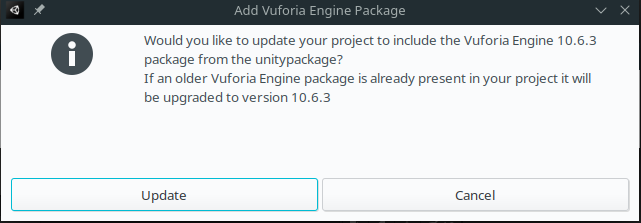

# Treballant amb Unity

## Pas 1. Creació del projecte

1. Des de Unity Hub, creem un nou projecte, de tipus 3D:

## Pas 2. Configuració de l'entorn

Una vegeada tenim el projecte creat anem a configurar alguns detalls del projecte, com la plataforma i Vuforia:

2. Afegim el plugin de Vuforia a l'editor de Unity com un recurs (Asset) més (*Assets > Import Package > Custom Package*, i seleccionem el fitxer del plugin de Vuforia per a Unity, que haurem descarregat de la web `add-vuforia-package-10-6-3.unitypackage`):

    

    Fem clic en Import i quan demane actualitzar el projecte per incloure Vuforia diem que sí (Update)

    

    El procés pot que siga una miqueta lent, ja que ha de descarregar diversos components i ajustar l'entorn.

    >
    > Amb açò tindrem l'editor preparat per treballar amb Vuforia, amb:
    > 
    > * Una nova entrada al menú de GameObject per a Vuforia
    > * Noves opcions per configurar el *Build* de les aplicacions
    > * Nous ajustos per al *Player*
    >

3. Importem la nostra base de dades com a altre recurs (Asset): *Assets > Import Package > Custom Package*, i seleccionem el fitxer unitypackage de la base de dades (`TallerRA.unitypackage`)

    

4. **Configuració dels ajustos de construcció del paquet**: Ara anirem a fer alguns ajustos al projecte, per indicar que la plataforma de destí és Android. Ho fem a través de *File > Build Settings*:

    

    On seleccionarem Android i farem clic en *Switch Platform*

5. **Configuració del reproductor (Player) per a Android**: Buscarem l'opció *Edit > Project Settings > Player*, i en l'apartat *Android* establim com a API mínima la 8. (*Other Settings > Identification > Minium API Level*)

6. Ara ja podem ajustar la vista del joc a una escala per exemple *18:9 Portrait*, per a que es vega com en un mòbil.

## Pas 3. Creació de l'escena

La finestra de Unity es divideix principalment en quatre grans blocs:

* La vista o vistes d'escena
* La finestre de jerarquía d'escena
* Les carpetes de projecte
* L'Inspector

### Pas 3.1. Preparació de la càmera de RA

Anem a preparar l'escena per treballar amb AR. Per a això:

1. Eliminem la càmera principal (Main Camera)
2. Afegim una ARCamera (*GameObject > Vuforia > AR Camera*)
3. **Configurem Vuforia**: En l'Inspector de la càmera AR, buscarem l'opció *Open Vuforia Engine Configuration*

Potser ens apareix el següent error, que resoldrem més avant.

En la configuració haurem de fer:

* Afegir la llicència que hem descarregat al camp *Apply License Key*

* En l'apartat *Device Tracker* ens assegurem de tindre desactivada l'opció *Include ARCode Library*.

* Si ens ha donat problemes amb la càmera (si esteu amb Linux, segut), canvieu *Play Mode > PlayMode Type* de *Webcam* a *Simulator*.

### Pas 3.2. Afegint nous Assets

Unity disposa a l'[Asset Store](https://assetstore.unity.com/), de gran quantitat de recursos per utilitzar als nostres projectes, tant gratuits com de pagament.

Anem a buscar recursos per al nostre projecte, per tal de crear els *Jaumemons*, els Pokémons particulars del Jaume II.

1. Buscarem en l'Asset Store pel terme *"Boximon"*, i marcarem els dos gratuits per incloure als nostres Assets. Per a tot açò, haurem d'estar logats a la Store.

2. Una vegada els tenim als nostres Assets, podem importar-los al projecte mitjançant el gestor de paquets: *Window > Package Manager*. En ell seleccionem *My Assets* i dins buscarem els dos *Boximon* que acabem d'afegir, els descarregarem i els importarem.

### Pas 3.3. Afegint *targets*

Els targets són els diferents *objectius* que anem a poder identificar amb la càmera de realitat augmentada. To i que hi ha diversos tipus, utilitzarem una imatge com a objectiu. Per a això, farem:

1. Afegim el target, amb GameObject > Vuforia Engine > Image Target.

2. Es crearà un GameObject de tipus ImageTarget, al que podem canviar el nom. Si el seleccionem, a l'inspector ens apareixen les seues propietats. Caldrà seleccionar, en el component *Image Target Behaviour* en lloc de *From Image* l'opció *From Database*.

I indicar la base de dades i la imatge que volem utilitzar:

3. Una vegada tenim la imatge, ubiquem la vista de forma que la pugue, veure *de cara* o de la millor forma que ens vinga per treballar.

4. A la finestra del projecte, busquem *Assets > Meshtint Free Boximon Cyclopes Mega Toon Series > Prefabs*, i arrosseguem el *Prefab* que hi ha a l'escena, per a que se situe davant de la imatge, i en la posició que volem:

>
> **És important ara, afegir l'objecte que hem creat *dins* del target, per associar aquest objecte amb la detecció del target. Això ho fem arrossegant el GameObject que acabem de crear a dins.**
>

En este cas, el personatge té aquestes components al Transform:

I bàscicament, això és tot, ara només quedaria, si ho desitgem, afegir interacció amb el personatge per fer joc ben senzill, així com tants *targets* diferents com vulguem.

>
> *Empaquetat*
>
> Ara ja deguem poder empaquetar l'aplicació (generar l'apk) i instal·lar-lo sobre el dispositiu i identificar els targets que tenim configurats.
> 
> Per a això, amb el cable USB connectat al vostre mòbil i amb les opcions de desenvolupador activades, així com la possibilitat de transferència de fitxers des de l'ordinador, farem:
>
> *File > Build And Run*
>

