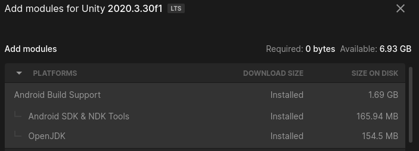

# Taller de Realitat augmentada. Tasques prèvies.

## Introducció a Unity 

Unity és una eina per a la creació de videojocs desenvolupada per Unity Technologies, el motor de la qual engloba diferents mòduls per gestionar la física tant en 2d com en 3d, l’àudio, les animacions i el renderitzat.

L’eina permet generar projectes per a diverses plataformes, tant mòbils com d’escriptori, web o videonsoles, i ofereix diversos serveis i una ampla documentació i comunitat d’usuaris.

El llenguatge de programació que utilitza és C#, molt semblant a Java i desenvolupat per Microsoft. Amb el temps, el llenguatge s’ha entandarditzat, i s’han creat implementacions lliures. Una d’aquestes implementacions, Mono, és en la que es basa Unity.

En la secció Made With de la seua web podeu trobar diversos projectes creats amb aquest motor, on no només trobareu videojocs, sinò també altres propostes experiències de realitat virtual o realitat augmentada.

## Creació d'un Unity ID i descàrrega de Unity Hub

Per tal de treballar amb Unity 3D necessitem dos coses prèviament:

* Un ID de Unity, per tal de gestionar les nostres llicències
* L'eina Unity Hub instal·lada al nostre ordinador, que serà la que ens descarregue l'editor de Unity i tot el programari addicional necessari.

Accedim a la web de [Unity](https://unity.com/es) i fem clic a [Comencemos](https://store.unity.com/es), on haureu de triar una llicència de tipus Personal (gratuïta). Des d'aci ja podreu [descarregar l'eina Unity Hub](https://unity.com/es/download), i registrar-vos, fent clic a la icona de la part superior dreta .

L'eina Unity Hub la podeu descarregar des de la [pàgina de descàrregues de Unity](https://unity.com/download)

L'eina Unity Hub podríem dir que és la porta a les aplicacions de Unity3D, i amb ella aneua poder instal·lar en un mateix equip diferents versions de l'Editor de Unity 3D, que és el que utilitzarem per desenvolupar jocs i aplicacions.

Teniu el procés documentat (tot i que per a una versió anterior) [en aquest enllaç](http://joamuran.net/docencia/pmdm/u4/1_unity/#22-creaci%C3%B3-dun-compte)

La versió que haureu d'instal·lar al vostre equip és la versió **2020.3 LTS**, i a més, instal·lar els mòduls per al suport complet per a Android (Android SDK&NDK Tools, OpenJDK). **Encara que ja disposeu d'un JDK a l'ordindador, és convenient utilitzar la versió que porta Unity, per tal d'evitar problemes de compatibilitat**.

També us dona la possibilitat d'afegir per defecte una versió de Visual Studio, però no ens farà falta perquè tenim VSCode o altres editors.

## Creació d'un compte amb Vuforia

Vuforia és un potent complement per a Unity3D que serveix per afegir-li funcionalitats per treballar amb realitat augmentada.

No es tracta d'una eina lliure, però per a finalitats no comercials podem utilitzar-la de forma gratuita, això sí, amb registre previ per tal de gestionar les nostres col·leccions d'imatges.

Així doncs, el que hem de fer en primer lloc és crear un compte a la [web de Vuforia](https://developer.vuforia.com/).

